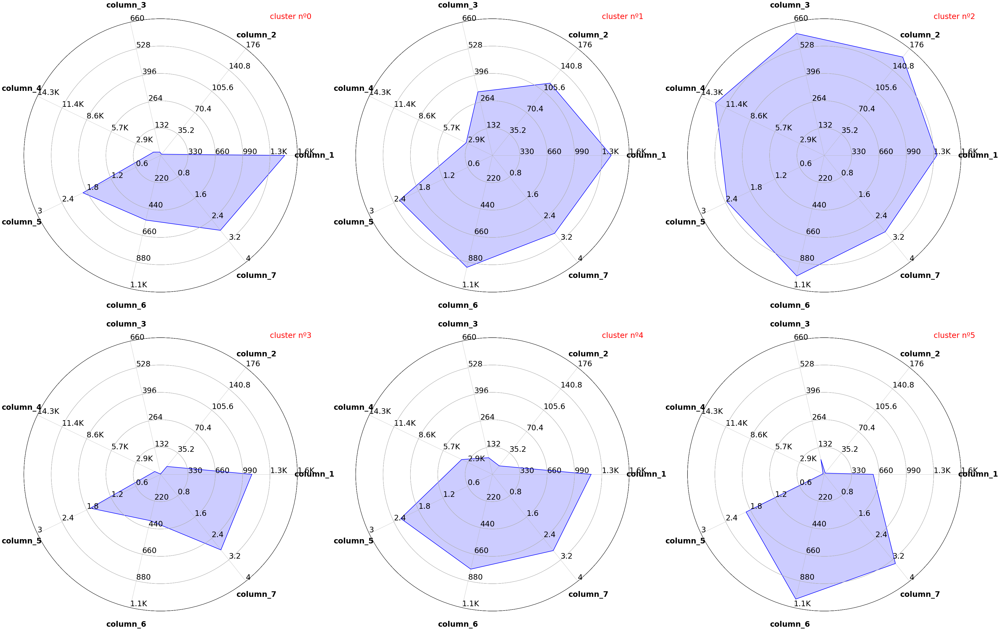

# Vestel Data Science Team Toolbox


<!-- PROJECT LOGO -->


<!-- TABLE OF CONTENTS -->
<details>
  <summary>Table of Contents</summary>
  <ol>
    <li>
      <a href="#about-the-project">About The Project</a>
    </li>
    <li>
      <a href="#getting-started">Getting Started</a>
      <ul>
        <li><a href="#installation">Installation</a></li>
        <li><a href="#radar-chart">Radar Chart</a></li>
        <li><a href="#descriptive-function">Descriptive Analysis</a></li>
      </ul>
    </li>

  </ol>
</details>


<!-- ABOUT THE PROJECT -->
## About The Project

The module has been created by the Vestel Data Science Team to provide data analysis tools tailored based on the Team's needs. 


<!-- GETTING STARTED -->
## Getting Started

### Installation


   ```sh
    pip install vdst-toolbox  
   ```


<!-- USAGE EXAMPLES -->
## Usage
### Radar Chart
Import libraries
   ```python
    from vdst_toolbox.visualizations.radar import RadarChart
    import pandas as pd
   ```
Create a DataFrame containing a cluster name/number column like the one shown below

   ```python
    df.head()
   ```
   |   cluster_no |   column_1 |   column_2 |   column_3 |   column_4 |   column_5 |   column_6 |   column_7 |
|-------------:|-----------:|-----------:|-----------:|-----------:|-----------:|-----------:|-----------:|
|            0 |       1497 |          2 |   16.4814  |    807.836 |    1.89102 |    533.63  |    2.80417 |
|            1 |       1432 |        119 |  314.986   |   3050.84  |    2.26239 |    924.091 |    2.91595 |
|            2 |       1359 |        162 |  603.935   |  12615.3   |    2.36108 |    994.759 |    2.85811 |
|            3 |       1101 |         13 |    1.64133 |    682.181 |    1.71153 |    382.01  |    2.82869 |
|            4 |       1191 |         14 |   82.4796  |   3573.95  |    2.23312 |    782.662 |    2.85384 |

Assign the __cluster_no__ column to the index:
```python
df.set_index("cluster_no", inplace=True)
```    
Initiate the RadarChart object with the default arguments and create the chart:
```python
radar = RadarChart(df, i_cols=3)
radar.create_chart()
```
  
You can tweak with the __i_cols__ argument in order to adjust the number of figures that will be placed into each row

### Descriptive Analysis
To be added...

<!-- LICENSE -->
## License
[MIT](https://choosealicense.com/licenses/mit/)


<!-- CONTACT -->
## Contact
Berkay Gökova - berkaygokova@gmail.com


<p align="right">(<a href="#top">back to top</a>)</p>

